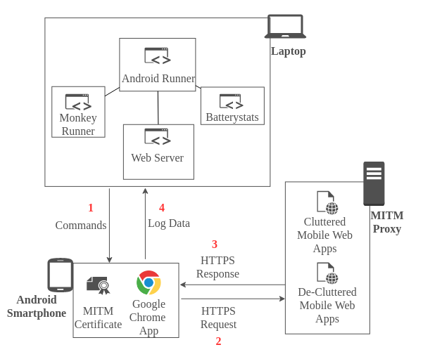

# The Impact of Cluttered JavaScript Code in Mobile Web Apps with respect to Energy Consumption

This repository showcases the ClutteredJS experiment developed by the team **The Energy Engineers** for the Green Lab course at Vrije Universiteit Amsterdam for the academic year 2020-21. All the information required to replicate the experiment is provided below.

## 1. Overview

Mobile phones are a major contributor to internet traffic around the world. Although the energy usage of a single smartphone may be considered reasonable, the overall energy footprint left by mobile devices is far higher. Concerning the energy consumption of different web elements in a mobile device, JavaScript is a major contributor. [JSCleaner](https://github.com/comnetsAD/MITM_JSCleaner) is a JavaScript decluttering tool for web applications which optimizes JavaScript files also removes non-essential codes from it. With this experiment, we aim to analyse the impact of energy consumption of cluttered JavaScript code with respect to its decluttered version.

## 2. Experiment Setup

The list of available decluttered webpages for the experiment is provided in the [Subject Selection Code](./Subject%20Selection%20Code) folder. The URLs are then [analysed](./Subject%20Selection%20Code/subjectSelection.ipynb) for subject selection.

### 2.1 System Setup

- Elementary OS 5.1.6 (Linux Distro based on Ubuntu LTS 18.04)
- Android Device (Google Pixel 3 with Android v9.0.0)
- Android Studio (v4.1)
- Python v3.8.0
- Java Development Kit (JDK v8)
- R Studio (v1.3.1093)

### 2.2 Setup Architecture
<p align="center">

</p>

## 3. Experiment Execution

### 3.1 Android Runner

For the execution of the experiment, we used [Android Runner](https://github.com/S2-group/android-runner) framework which allows automatic execution of measurement-based experiments on native and web apps running on Android devices. All the experiment-specific Python scripts and configs are included in the [android-runner/ClutteredJS](./android-runner/ClutteredJS) folder.

### 3.2 MITM Proxy

The cluttered and decluttered web applications are hosted using [MITM Proxy](https://mitmproxy.org/) with separate ports for each kind. The mitm proxy certificate is installed in the android device after configuring it with appropriate IP address and port for the mitmproxy.


### 3.3 Execution and Output
```
python3 android-runner android-runner/ClutteredJS/config.json
```

The experiment can be executed using the above command and the corresponding output for the run will be stored in `android-runner/ClutteredJS/output` folder.
The output of experiments of cluttered and decluttered webpages are stored in [android-runner/ClutteredJS/output.nw](./android-runner/ClutteredJS/output.nw) and [android-runner/ClutteredJS/output.jsc](./android-runner/ClutteredJS/output.jsc) folders respectively.

## 4. Results and Analysis

The output of the experiment is [analysed](./R%20Code) and plotted using various tests **TODO**. Detailed analysis and results of the experiment is included in [Report](./Report) folder.

## 5. Authors and Acknowledgments

The experiment is designed, developed and executed by [Marc Wiggerman](mailto:m.g.wiggerman@student.vu.nl), [Sophie Vos](mailto:s.o.vos@student.vu.nl), [Geoffrey van Driessel](mailto:g.r.van.driessel@student.vu.nl) and [Abijith Radhakrishnan](mailto:mail@abijith.net). 
We thank [Dr. Ivano Malavolta](http://www.ivanomalavolta.com/) for his guidance and detailed feedback. We would also like to thank [JSCleaner research team](https://nyuscholars.nyu.edu/en/publications/jscleaner-de-cluttering-mobile-webpages-through-javascript-cleanu) for their research and providing access to the cluttered and decluttered web pages with mitmproxy server.